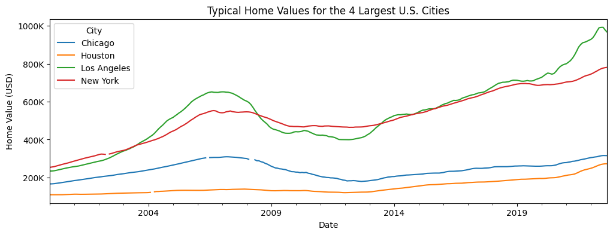

# Zillow Home Value Time Series Analysis

## Project Overview
This project analyzes the **Zillow Home Value Index (ZHVI)** for the four largest U.S. cities using time series techniques.  
The goal is to prepare the dataset for time-based analysis, visualize long-term trends, and answer specific economic questions related to the 2008 housing market.

The four cities analyzed are:
- New York
- Los Angeles
- Chicago
- Houston

---

## Dataset
- Source: Zillow Home Value Index (City-level, monthly)
- Frequency: Monthly
- Metric: Typical home value (USD)
- Time span: Multiple decades (filtered as needed per question)

---

## Part 1: Data Preparation
Steps performed:
- Loaded the Zillow dataset (wide format with dates as columns)
- Filtered the **4 largest cities** using `SizeRank` values `[0, 1, 2, 3]`
- Melted the dataset into **long format** for time series analysis
- Converted date columns to `datetime`
- Set the date column as a `DatetimeIndex`
- Grouped by city and resampled to **monthly frequency**

This resulted in a clean, city-level monthly time series dataset suitable for analysis and visualization.

---

## Part 2: Visualization

### Typical Home Values Over Time
The figure below shows the evolution of typical home values for the four largest U.S. cities.

Visualization details:
- One line per city
- Monthly frequency
- Y-axis formatted in **thousands of dollars (K)** using `FuncFormatter`
- Clear title and axis labels

Key observation:
- Los Angeles and New York consistently show higher home values
- All cities experienced a sharp decline during the 2008 financial crisis
- Long-term recovery trends are visible after 2012

---

## Part 3: Analytical Questions

### Question 1  
**Which city had the highest and lowest typical home value at the end of 2008?**

Answer:
- Highest: **New York** — \$510,309
- Lowest: **Houston** — \$131,283

This was determined by selecting December 2008 values and comparing across cities using pandas indexing.

---

### Question 2  
**How much did home values change from November 2008 to December 2008?**

Month-to-month changes (USD):

| City         | Change (Nov → Dec 2008) |
|--------------|--------------------------|
| Chicago      | -\$5,753                 |
| Houston      | -\$964                   |
| Los Angeles | -\$12,611                |
| New York     | -\$4,458                 |

Key takeaway:
- All four cities experienced **declines** during this period
- Los Angeles had the largest month-to-month drop
- Houston was the least affected in absolute dollar terms

---

## Key Concepts Used
- Wide vs long-form time series data
- `melt()` for reshaping datasets
- `DatetimeIndex` and resampling
- MultiIndex operations (`unstack`)
- Time-based slicing with pandas
- Month-to-month differencing using `.diff()`
- Tick formatting with `matplotlib.ticker.FuncFormatter`

---

## Conclusion
This analysis demonstrates how time series preprocessing and normalization allow for meaningful comparisons across cities.  
By focusing on consistent frequency, proper indexing, and clear visualizations, we were able to uncover clear economic patterns surrounding the 2008 housing market downturn.

The notebook structure and methods used here can be reused for other city-level or regional housing analyses.
